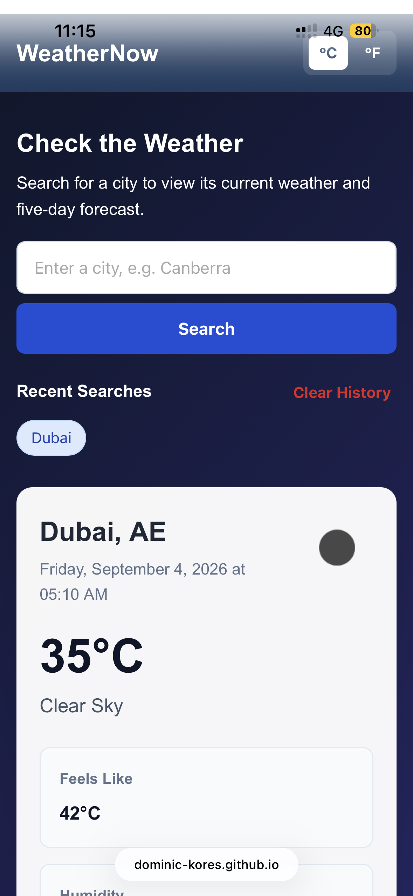

# 🌦️ WeatherNow - Weather Dashboard

## Overview

**WeatherNow** is a responsive weather dashboard built using **HTML, CSS, and JavaScript**.

The application allows users to search for any city and view its current weather together with a **5-day forecast** using the **OpenWeatherMap API**.

This project combines advanced JavaScript concepts such as:

- `async/await`
- Fetch API
- Promises
- DOM manipulation
- Array methods
- Object destructuring
- Error handling
- `localStorage`
- Application state
- Responsive design

---

## Main Features

WeatherNow allows users to:

- Search for weather by city
- Press **Enter** or click the Search button
- View city and country
- View current temperature
- View weather description and icon
- View feels-like temperature
- View humidity
- View wind speed
- View atmospheric pressure
- View local date and time
- View a **5-day forecast**
- Switch between **°C and °F**
- Save unit preference in `localStorage`
- Save the last **10 searched cities**
- Click previous searches to search again
- Clear search history
- View loading and error messages
- Use the dashboard on desktop, tablet, and mobile devices

---

## 5-Day Forecast

The OpenWeatherMap forecast API returns weather data approximately every **3 hours**.

WeatherNow processes this data by:

1. Grouping forecasts by date
2. Skipping today's partial forecast
3. Calculating the daily high temperature
4. Calculating the daily low temperature
5. Choosing weather conditions closest to midday
6. Displaying the next five days

Each card includes:

- Day name
- Weather icon
- High temperature
- Low temperature
- Weather description

---

## Celsius and Fahrenheit

Users can switch between:

```text
°C
```

and:

```text
°F
```

The application converts Celsius using:

```text
°F = (°C × 9 / 5) + 32
```

The weather is **not fetched again** when the unit changes. Existing data is simply re-rendered.

---

## Search History

Successful searches are saved using `localStorage`.

Example:

```text
[ Canberra ] [ Nairobi ] [ Dubai ]
```

The application:

- Stores up to 10 cities
- Prevents duplicate entries
- Allows previous searches to be clicked
- Includes a Clear History button

---

## Error Handling

The application handles common errors such as:

```text
City not found.
Invalid API key.
Too many requests.
Unable to retrieve weather information.
No internet connection.
```

Error handling is implemented using:

```javascript
try {
    // Fetch weather
} catch (error) {
    // Display error
} finally {
    // Remove loading state
}
```

---

## Technologies Used

- HTML5
- CSS3
- JavaScript
- OpenWeatherMap API
- Fetch API
- `localStorage`
- Git
- GitHub
- VS Code

---

## Project Structure

```text
weather-dashboard/
│
├── index.html
├── README.md
│
├── 
│   └── style.css
│
├── 
│   └── app.js
│
└── images/
    
```

---

## Running the Project

### 1. Add your API key

Open:

```text
app.js
```

Replace:

```javascript
const API_KEY = "f9a58ba5819f6bb37862aac46523c5e9";
```

with your OpenWeatherMap API key.

### 2. Run the application

Open `index.html` in your browser or use **Live Server** in VS Code.

---

## Screenshots

Store screenshots inside:

```text
images/screenshots/
```

Example:

```markdown


```


---

## Key JavaScript Skills Used

This project demonstrates:

```text
async/await
fetch()
Promise.all()
try/catch/finally
map()
filter()
forEach()
slice()
Object.entries()
spread syntax
Math.max()
Math.min()
DOM manipulation
event listeners
JSON
localStorage
application state
```

## Live pages
https://dominic-kores.github.io/week-3-weather-dashboard/

---

## Summary

WeatherNow is a practical JavaScript project that demonstrates how to build a complete application using an external API.

The project helped combine previously learned JavaScript concepts into one application, including API integration, asynchronous programming, DOM manipulation, local storage, error handling, forecast data processing, and responsive web design.

It also demonstrates how raw API data can be transformed into useful information such as **daily highs, lows, conditions, and a 5-day forecast**.

---

## Author

**Dominic Kores**

Full-Stack Software & AI Engineering Student
